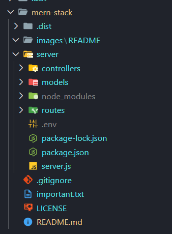

# My MERN Stack Progress

This repository is for the purpose of keeping a track of my progress in mern stack.

👀️

## Table of Contents

1. [Introduction](#introduction)
2. [Required Dependencies](#required-dependencies)
3. [Initialising Express](#initialising-express)
   * [REST API](#rest-api)
   * [Routing](#routing)
4. [Getting into MongoDB](#getting-into-mongodb)
   * [MongoDB Atlas](#mongodb-atlas)
   * [Models and Schemas](#models-and-schemas)
5. [Controllers](#controllers)
6. [Resources](#resources)
7. [Contributing](#contributing)
8. [License](#license)

## Introduction

A note before beginning - this is gonna be a lot more informal, for the sole purpose of my understanding, so please bear with it.

The MERN stack is a full-stack web development framework that provides a robust set of tools and technologies for building dynamic web applications. MERN is an acronym that stands for MongoDB, Express.js, React, and Node.js. Each component of the stack serves a specific purpose in the development process, allowing developers to create modern, scalable, and efficient web applications.

<a id = "introduction"><a/>

### Components of the MERN Stack:

1. **MongoDB**

   MongoDB is a NoSQL database that uses a document-oriented data model. It provides flexibility and scalability by allowing developers to store data in JSON-like documents. MongoDB is highly scalable and is well-suited for handling large volumes of data and complex queries.
2. **Express.js**

   Express.js is a minimalist web application framework for Node.js. It provides a robust set of features for building web applications and APIs. Express.js simplifies the process of handling HTTP requests, routing, middleware integration, and more. It is widely used in combination with Node.js to create server-side applications.
3. **React**

   React is a JavaScript library for building user interfaces. Developed by Facebook, React allows developers to create reusable UI components that can efficiently update and render based on data changes. React follows a component-based architecture, making it easier to manage complex UIs and maintain code scalability. It is commonly used for building interactive and single-page web applications.
4. **Node.js**

   Node.js is a server-side JavaScript runtime environment built on Chrome's V8 JavaScript engine. It enables developers to run JavaScript code on the server, allowing for the development of scalable and high-performance web applications. Node.js provides a non-blocking, event-driven architecture, making it suitable for building real-time applications and handling concurrent requests efficiently.

## Required Dependencies

First and foremost, u would need to install node, which u can do [here](https://nodejs.org/en)

After that, we're ready to go. To start with, use `npm` (node package manager)to install all the required dependencies

<a id = "required-dependencies"><a/>

* Express

  ```
  npm install express
  ```
* Mongoose(for MongoDB)

  ```
  npm install mongoose
  ```
* Nodemon(for ease of restarting node server)

  ```
  npm install nodemon
  ```
* CORS

  ```
  npm install cors
  ```
* Dotenv(to use environmental variables)

  ```
  npm install dotenv
  ```

*Additional packages/tools:*

* Pino(logging library)

  ```
  npm install pino
  ```
* Pino http(logging for http servers)

  ```
  npm install pino-http
  ```
* Pino pretty(cuz why not!)

  ```
  npm install pino-pretty
  ```
* Postman(a tool):

  Its a useful application to test the server by performing the REST api calls(get,post,put,delete,patch)

Anyways, your project structure would be similar to this



## Initialising Express

The main server file is gonna be `server.js`/`app.js` or whatever u want to call it. It would contain all the routes(later just connecting all the routes through a different file) and stuff. So create `server.js` in the **server** directory. Then requrie the modules that you're gonna use. For example, to use express in `server.js`, do this:

```
const express = require('express');
```

Similarly, you will have to requrie all other modules that you use in any js file

Now moving on, initialsie a constant (say `app`) to the express function(express(); kind of like creating an express app). All the rest apis and other stuff will be used through this `app`

At the end of the file, you will have to 'listen' this `app` on a port(say 3000), that is, in a nutshell, to specify what port the server will run on . For checking if the server works, lets also add a get request. So you're `server.js` will look something like this:

```
const express = require('express')
const PORT = 3000

const app = express()

app.get('/', (req,res) => {
  res.status(200).json({msg: "hello"})
})
app.listen(PORT, () => {
  console.log(`Server running at http://localhost:${PORT}/`)
})
```

If everything goes well, then upon running and going to the [local server](http://localhost:3000/), it should work and perform a ger request, and hence you should see something like this:

```
{
  msg: "hello"
}
```

And voila!! We have run an express app.


<a id = "initialising-express"><a/>

### REST API


<a id = "rest-api"><a/>

### Routing

<a id = "routing"><a/>

## Getting into Mongodb

<a id = "getting-into-mongodb"><a/>

### Mongodb Atlas

<a id = "mongodb-atlas"><a/>

### Models and Schemas

<a id = "models-and-schemas"><a/>

## Controllers

<a id = "controllers"><a/>

## Resources

* [Net ninja's mern stack playlist](https://www.youtube.com/watch?v=98BzS5Oz5E4&list=PL4cUxeGkcC9iJ_KkrkBZWZRHVwnzLIoUE)
* [An express specific playlist](https://youtube.com/playlist?list=PL_cUvD4qzbkwjmjy-KjbieZ8J9cGwxZpC&si=BfJ_AXvR2wWeUOn6)
* [Express documentation](https://expressjs.com)
* [Mongoose documentation](https://mongoosejs.com/docs/)


<a id = "resources"><a/>

## Contributing

<a id = "contributing"><a/>

## License

<a id = "license"><a/>
