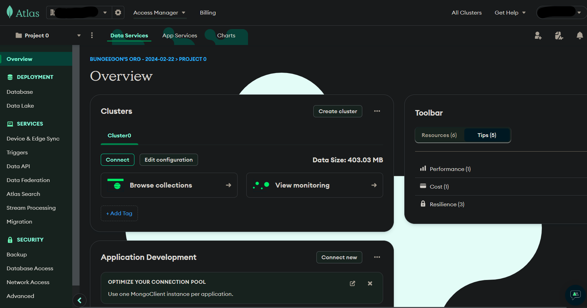

# My MERN Stack Progress

This repository is for the purpose of keeping a track of my progress in mern stack.

👀️

## Table of Contents

1. [Introduction](#introduction)
2. [Required Dependencies](#required-dependencies)
3. [Initialising Express](#initialising-express)
   * [REST API](#rest-api)
   * [Routing](#routing)
4. [Getting into MongoDB](#getting-into-mongodb)
   * [MongoDB Atlas](#mongodb-atlas)
   * [Models and Schemas](#models-and-schemas)
5. [Controllers](#controllers)
6. [Resources](#resources)
7. [Contributing](#contributing)
8. [License](#license)

## Introduction

A note before beginning - this is gonna be a lot more informal, for the sole purpose of my understanding, so please bear with it.

The MERN stack is a full-stack web development framework that provides a robust set of tools and technologies for building dynamic web applications. MERN is an acronym that stands for MongoDB, Express.js, React, and Node.js. Each component of the stack serves a specific purpose in the development process, allowing developers to create modern, scalable, and efficient web applications.

<a id = "introduction"><a/>

### Components of the MERN Stack:

1. **MongoDB**

   MongoDB is a NoSQL database that uses a document-oriented data model. It provides flexibility and scalability by allowing developers to store data in JSON-like documents. MongoDB is highly scalable and is well-suited for handling large volumes of data and complex queries.
2. **Express.js**

   Express.js is a minimalist web application framework for Node.js. It provides a robust set of features for building web applications and APIs. Express.js simplifies the process of handling HTTP requests, routing, middleware integration, and more. It is widely used in combination with Node.js to create server-side applications.
3. **React**

   React is a JavaScript library for building user interfaces. Developed by Facebook, React allows developers to create reusable UI components that can efficiently update and render based on data changes. React follows a component-based architecture, making it easier to manage complex UIs and maintain code scalability. It is commonly used for building interactive and single-page web applications.
4. **Node.js**

   Node.js is a server-side JavaScript runtime environment built on Chrome's V8 JavaScript engine. It enables developers to run JavaScript code on the server, allowing for the development of scalable and high-performance web applications. Node.js provides a non-blocking, event-driven architecture, making it suitable for building real-time applications and handling concurrent requests efficiently.

## Required Dependencies

First and foremost, u would need to install node, which u can do [here](https://nodejs.org/en)

After that, we're ready to go. To start with, use `npm` (node package manager)to install all the required dependencies

<a id = "required-dependencies"><a/>

* Express

  ```
  npm install express
  ```
* Mongoose(for MongoDB)

  ```
  npm install mongoose
  ```
* Nodemon(for ease of restarting node server)

  ```
  npm install nodemon
  ```
* CORS

  ```
  npm install cors
  ```
* Dotenv(to use environmental variables)

  ```
  npm install dotenv
  ```

*Additional packages/tools:*

* Pino(logging library)

  ```
  npm install pino
  ```
* Pino http(logging for http servers)

  ```
  npm install pino-http
  ```
* Pino pretty(cuz why not!)

  ```
  npm install pino-pretty
  ```
* Postman(a tool):

  Its a useful application to test the server by performing the REST api calls(get,post,put,delete,patch)

Anyways, your project structure would be similar to this


## Initialising Express

The main server file is gonna be `server.js`/`app.js` or whatever u want to call it. It would contain all the routes(later just connecting all the routes through a different file) and stuff. So create `server.js` in the **server** directory. Then requrie the modules that you're gonna use. For example, to use express in `server.js`, do this:

```
const express = require('express');
```

Similarly, you will have to requrie all other modules that you use in any js file

Now moving on, initialsie a constant (say `app`) to the express function(express(); kind of like creating an express app). All the rest apis and other stuff will be used through this `app`

At the end of the file, you will have to 'listen' this `app` on a port(say 3000), that is, in a nutshell, to specify what port the server will run on . For checking if the server works, lets also add a get request. So you're `server.js` will look something like this:

```
const express = require('express')
const PORT = 3000

const app = express()

app.get('/', (req,res) => {
  res.status(200).json({msg: "hello"})
})
app.listen(PORT, () => {
  console.log(`Server running at http://localhost:${PORT}/`)
})
```

If everything goes well, then upon running and going to the [local server](http://localhost:3000/), it should work and perform a ger request, and hence you should see something like this:

```
{
  msg: "hello"
}
```

And voila!! We have run an express app.

### Environment Variables

Now lets, say we wanna use api keys, passwords or connection strings. We cannot directly upload it to github, as it'll be open for everyone to use. That is where environment variables come in. First create a file caleld `.env`, which would contain all the secret keys that you are gonna use in ur project. For example, lets say i wanna store the 3000 port in it. In the `.env` file, just do this:

```
PORT=3000
```

Now, as usual, require the dotenv module in `server.js`, specifically do `require('dotenv').config()`. Then, in the place of `PORT`, use `process.env.PORT`

Finally, add the .env file in the .gitignore so that it does not get pushed while doing git commit and push to your repository.

<a id = "initialising-express"><a/>

### REST API

A REST API (Representational State Transfer Application Programming Interface) is a set of rules and conventions that enable communication between different software systems over the internet. It follows the principles of REST, which emphasize a stateless client-server architecture, uniform interface, and scalability. REST APIs use standard HTTP methods such as GET, POST, PUT, DELETE, and PATCH to perform CRUD (Create, Read, Update, Delete) operations on resources. They typically communicate using JSON or XML formats for data interchange. REST APIs are widely used in modern web development, providing a flexible and efficient way to build distributed systems, including those in the MERN stack, where they facilitate interactions between the client-side and server-side components.


* GET:

  The GET method is used to request data from a specified resource. In a MERN stack, a GET request might be used to fetch a list of items from the server, retrieve a single item by its ID, or perform a search operation. It is commonly used in scenarios where you need to retrieve data without altering the server state.
* POST:

  The POST method is used to submit data to be processed to a specified resource. In a MERN stack, a POST request might be used to add a new item to a database, submit a form, or send data for processing. It is commonly used in scenarios where you need to create or update server-side data.
* PUT:

  It updates the data


<a id = "rest-api"><a/>

### Routing

Routes are a key aspect of not just web pages, but any API in general. For example, lets say u have an account on github, so how do you specifically go to you account settings, or say a specific repository.

Take this repository for example - `https://github.com/Dhaarun-Abhimanyu/mern-stack`
My repository is located in the route `*/Dhaarun-Abhimanyu/mern-stack*` on GitHub. To be more specific, we do a get request at this route to whatever data is there in this route. Similarly, we would be different routes in an express application for various kind of requests. For now, we'll just look into the basic ones.

```
app.get('/api/todolist', (req,res) => {
  res.status(200).json({"msg": "MERN is great!!"})
})

app.get('/api/todolist/:id', (req,res) => {  //by specific id
  const id = req.params.id
  res.status(200).json({"msg": "hello "+id})
})
```

These are simple get request routes for the application(Let other rest api methods until we get into mongodb). In theory, we could just add all the routes in the main server file. But the file becomes really lengthy and gets harder to debug. So we would be creating a `routes` folder and putting all our routes there. In this case, we notice that we're using the same route fields - `/api/todolist`. So we'll be creating a js file specific to all the requests in this route and have it in the routes folder. Add the following in the server.js:

```
const todoRoutes = require('./routes/todolist.js');
.
.
.
//middleware
app.use(express.json());//lets u use req.body

app.use('/api/todolist', todoRoutes)
```

So all the routes pertaining to `/api/todolist` will automatically go to todoRoutes, that is, to the todolist.js in the routes folder. Now in that js file:

```
const express = require('express')

const router = express.Router();

router.get('/', (req,res) => {
  res.status(200).json({"msg": "Konicchiva!"})
})

router.get('/:id', (req,res) => {
  const id = req.params.id
  res.status(200).json({"msg": "Sup "+id+"!"})
})
```

One thing to notice here is that we only use the routes `'/'` and `'/:id'`, because we already call this file to all the requests in the route `'/api/todolist'`. So thats it about routing for now.

<a id = "routing"><a/>

## Getting into MongoDB

Finally, getting into the database. Now what is MongoDB?
MongoDB is a popular, open-source NoSQL database that stores data in flexible, JSON-like documents. It allows for dynamic schemas, making it ideal for applications requiring scalability and high performance. MongoDB supports horizontal scaling through sharding and ensures high availability with replica sets.

### Key Featurs of MongoDB
- **Document-Oriented Storage**:
  - Data is stored in BSON (Binary JSON) format, allowing for rich, nested data structures. Each document can have a different schema, making it highly flexible and suitable for evolving applications.

- **Flexible Schema**:
  - MongoDB does not require a predefined schema, allowing developers to modify the structure of documents without downtime. This makes it ideal for agile development and applications with changing requirements.

- **Horizontal Scalability**:
  - MongoDB supports sharding, a method for distributing data across multiple servers. This allows the database to handle large volumes of data and high-throughput applications by scaling horizontally.

- **High Availability**:
  - Replica sets in MongoDB provide redundancy and automated failover. Each replica set consists of multiple nodes, with one primary node receiving all writes and secondary nodes replicating the data, ensuring data availability and durability.

- **Powerful Query Language**:
  - MongoDB offers a rich query language that supports CRUD operations, field, range queries, regular expression searches, and more. It also includes an aggregation framework for performing complex data transformations and analyses.

<a id = "getting-into-mongodb"><a/>

### Mongodb Atlas

You have two choices - either have a local database scaling with your local storage, or an online database with storage constraints(will have to pay up to expand storage and speed in online dbs)
- Cloud databases are hosted, managed, and maintained by a third-party cloud service provider like Amazon Web Services (AWS), Microsoft Azure, or Google Cloud Platform (GCP). These databases are delivered over the Internet, giving you the ability to access, store, manage, and analyze data from anywhere with an Internet connection.
- On-premises databases reside within your organization’s physical premises, typically on the company’s own servers. This means you’re responsible for providing the infrastructure, hardware, and software required to manage the database. On-premises databases are perceived to be more secure than the cloud since you’re in full control of your data.

Scalability and accessibility are two key aspects of why one would choose a cloud hosted db. For this project, we would be using Mondodb Atlas - a cloud hosted db that mongo provides us for free!(with a 512mb limit, after which u have to pay up). 512 mb is more than enough for a small scale project like this. Anyways first things first, you'll have to create an account for atlas [here](https://www.mongodb.com/cloud/atlas/register)

Then, you'll have to create a cluster, after which the dashboard will look something like this



Then once u connect, you'll get a connection string in the format - `mongodb+srv://<username>:<password>...`
This is a really important connection string, so you'll have to put in the `.env` file and use it. Also do
```
npm install mongoose
```

As we'll be using the `mongoose` module to access and post data in mongodb. Anyways, now you'll be connecting to the db with the following code:
```
const mongoose = require('mongoose')
.
.
.
mongoose.connect(process.env.MONGO_URI)
    .then(() => {
        app.listen(process.env.PORT,() => {
            console.log(`Server running at http://localhost:${process.env.PORT}/`);
        })
    })
    .catch((error) => {
        console.log("Error - Can't connect to Mongoose")
    });
```

If everything goes well, you'll get the "Sever running at ..." message, meaning you have successfully connected to the database.

Now, lets try out the following code in the todolist.js route for a get request:(explicitly create a collection at atlas before that)

```
const mongoose = require('mongoose')
.
.
.
router.get('/',async (req,res) => {   //obviously its asynchronous
  try{
    const db = mongoose.connection
    const db = db.collection('todoCollection')
    const todo = await collection.find({}).sort({ createdAt: -1 })  //empty {} in find() means it'll get all the documents
    res.status(200).json(todo)
  }
  catch(error){
    res.status(400).json({error: error.message})
  }
})
```
Once you do a get request in this route, you should get the data in that collection as a json(Quick note, you can use something called postman, which is useful in testing api calls and requests. You can download it [here](https://www.postman.com))


<a id = "mongodb-atlas"><a/>

### Models and Schemas

Mondgodb can accept any kind of data. It is a NoSQL db after all. But it always better to have models and scheme(in fact, you dont have to create a collection if you create a model in the code. Mondgodb will automatically create a collection for you based on the model name you use). So firstly, we'll be creating a folder `models`, similar to routes. There we will be creating a file todolistModels.js, which will contain the following code:

```
const mongoose = require('mongoose');

const Schema = mongoose.Schema;

const todoSchema = new Schema({
    title: {
        type: String,
        required: true
    },
    number: {
        type: Number,
        required: true
    },
    activity: {
        type: String,
        required: true
    }
},{timestamps: true});//as the name says, it adds timestamps to the schema

module.exports = mongoose.model('Todo', todoSchema);
```

Here, we'll also added a Scheme. Meaning, if the data one posts does not contain {title,number,activity}, (that is, has lesser or more fields, or the fields are not in the specified data type), then mongodb wouldnt accept that data.

We would then import this model and use its Schema in the routes;
```
const todoModel = require('../models/todolistModels.js')
.
.
.
router('/', async (req,res) => {
  try{
        const todo = await todoModel.find({}).sort({createdAt: -1})
        res.status(200).json(todo)
  }catch(error){
        res.status(400).json({error: error.message})
  }
})
```

So that's pretty much it

<a id = "models-and-schemas"><a/>

## Controllers

Controllers isnt anything new. We create async functions in each request in the route. Doing that would make the route files more lenghty. So controllers are basically just files that would contain these files, which in turn get imported in the routes to be used. The whole point of the `routes`, `models`, `controllers`, is to make the project more organised and easier to debug, as it becomes hectic as the scale of the project increases. So create a todoControllers.js in the `controllers` folder, whose code would be something like this:
```
const todoModel = require('../models/todolistModels.js')

const getTodo = async(req,res) => {
    try{
        const todo = await todoModel.find({}).sort({createdAt: -1});
        res.status(200).json(todo)
    }catch(error){
        res.status(400).json({error: error.message});
    }
}

//get one todo
const getOneTodo = async(req,res) => {
    try{
        const todo = await todoModel.findById({_id: req.params.id});
        if(!todo){
            return res.status(404).json({error: 'No such Todo'});//return is used to stop the execution of the function
        }
        res.status(200).json(todo);
    }catch(error){
        res.status(400).json({error: error.message});
    }
}
.
.
.//other functions for other requests

module.exports = {
  getTodo,
  getOneTodo,
  ...//other functions
}
```

Then, import these functions to the routes file:

```
const express = require('express');

const {
    createTodo,
    getTodo,
    getOneTodo,
    ...
} = require('../controllers/todoControllers.js');

const router = express.Router();

router.get('/', getTodo);//get all

router.get('/:id', getOneTodo);//get one

router.post('/post',<post function>);//create one

router.delete('/:id', <delete function>);//delete one

router.patch('/:id', <patch function>);//update one

module.exports = router;
```

So the backend has been built for now. That is, you can now successfully make requests to the database and process it. For now, the project structure would look like this(as shown earlier):


Bravo!!

Now, we'll be moving into creating a dynamic frontend using React

<a id = "controllers"><a/>

## Resources

* [Net ninja's mern stack playlist](https://www.youtube.com/watch?v=98BzS5Oz5E4&list=PL4cUxeGkcC9iJ_KkrkBZWZRHVwnzLIoUE)
* [An express specific playlist](https://youtube.com/playlist?list=PL_cUvD4qzbkwjmjy-KjbieZ8J9cGwxZpC&si=BfJ_AXvR2wWeUOn6)
* [Express documentation](https://expressjs.com)
* [Mongoose documentation](https://mongoosejs.com/docs/)

<a id = "resources"><a/>

## Contributing

<a id = "contributing"><a/>

## License

<a id = "license"><a/>
